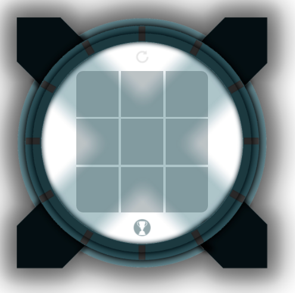
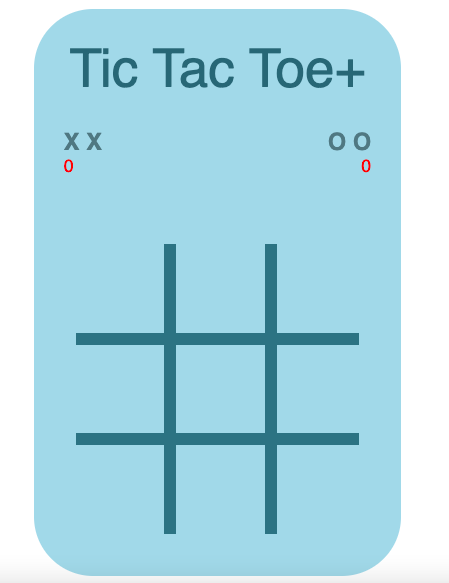

# Project0.1

This is the second attempt at the project0 tic-tac-toe project.

### Preview

#### Currently hosted at -
https://christopherdavidjohnson.github.io/Project-0.1/

##  ---- To Do List ----

1. Let user input player names
2. Change hard animation transitions
4. Have animations spin opposite ways when win happens
3. Fix bug where first 2 games are started by player x
5. Change the background spinning X colour from black to themed dark green/blue
6. Change font styling for the board and the scoreboard
7. Change background shadows from being handled by the image (static) to adaptive and directional CSS shadows.
8. Change the names for the CSS animations and keyframes to something more logical and easy to understand.
9. Change the colour of the reset button from black to themed green/blue
10. Change the colour of the fireworks?
11. Change the game board X and O to match the background X and O (will look better and make the 'who's turn is it' feature more obvious).
12. Fix bug where if you click just off to the side of the cells you reset the game.

#### Link to previous version (project 0.0)
https://christopherdavidjohnson.github.io/Project-0.0/

